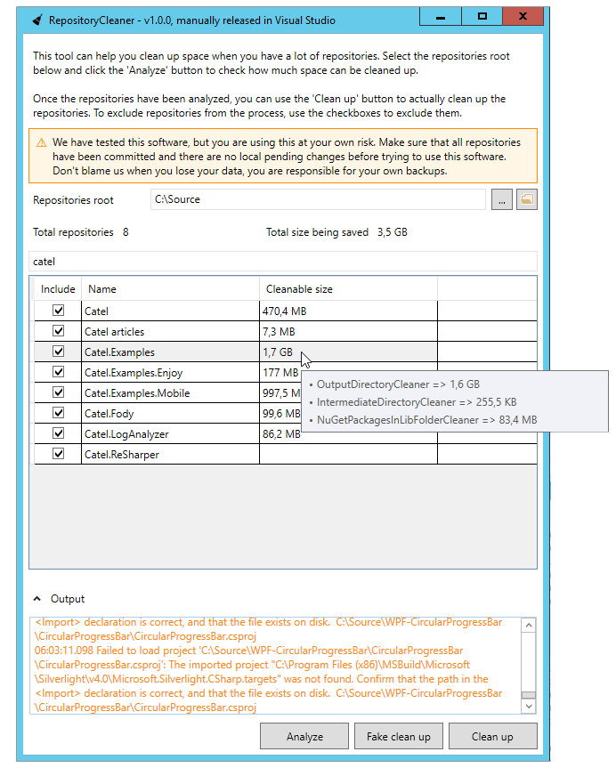

# Repository Cleaner

Tool to easily clean repositories on a large scale. When you are developing on a lot of repositories, your computer might run out of disk space very easily. One can solve this by either providing more disk space (for example, expanding a virtual disk), but after expanding a disk twice with 10 GB, this tool was created.

  

As the image below shows, a test with 130 repositories resulted into **30 GB of saved disk space**. This means that an average repository takes about 200 MB of space which might not be needed all the time. 

  

# How to use

The usage is extremely simple. Just point to the right directory and hit *Analyze*. Analyzing can take a while, depending on the number of repositories.

## Checking the details of a repository

To check out the details of a repository (to see what takes the most space), hover the size to check how much space each implemented cleaner can clean up.

## Cleaning up the repositories

There are 2 ways to clean up a repository. The fake clean up allows one to test / check what will go on during a clean. This mode will not actually delete any files.

# How to get

There are 2 general ways to get the software:

## Get it from GitHub

The releases will be available as separate executable download on the [releases tab](https://github.com/CatenaLogic/RepositoryCleaner/releases) of the project.

## Get it via Chocolatey

If you want to install the tool on your (build) computer, the package is available via <a href="https://chocolatey.org/" target="_blank">Chocolatey</a>. To install, use the following command:

    choco install repositorycleaner --pre

# Icon

Broom by Anna Weiss from The Noun Project